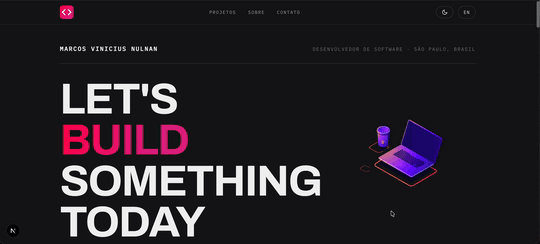

# Marcos Vinícius — Portfolio

A bilingual (PT/EN) personal portfolio built with **Next.js, React and TypeScript**, designed as an editorial-style case study experience. It curates a set of highlighted projects, pulls real repositories from the GitHub API, and presents each one in a dedicated case page with live screenshots, problem/solution narrative, features and tech stack.

The site has its own design system — a dark premium look with a single magenta (`#f05`) accent, rounded cards, hand-drawn arrows and smooth scroll-reveal animations powered by `motion`.

---

## Goal

The main goal of this project is to serve as a professional showcase: present the developer's experience, skills and selected work in a way that feels considered and polished, while keeping the content easy to maintain.

It also explores how a portfolio can be **automatically kept up to date**:

| Concern | How it is handled |
| --- | --- |
| Featured projects | Manually curated order in `config/site.ts` → `projects.featured` |
| Real repositories | Fetched from the GitHub REST API with caching (`revalidate: 3600`) |
| Conversation / content | Local typed data files (`data/profile.ts`, `data/cases.ts`) — no CMS needed |
| Bilingual | `next-intl` with `pt` (default, unprefixed) and `en` (`/en`) locales |
| Contact form | `react-hook-form` + `zod` validation, sent via Resend |

## Learning objectives

- Build a modern App Router application with Next.js 16 and React 19.
- Implement internationalization (i18n) with `next-intl`, including locale routing and localized metadata.
- Integrate a third-party API (GitHub) with server-side fetch and stale-while-revalidate caching.
- Design a cohesive design system with CSS variables and a dark/light theme toggle.
- Create fluid scroll animations and micro-interactions without a heavy animation framework.
- Validate a form client and server side with a shared `zod` schema.

---

## Tech Stack

### Frontend

- **Next.js 16** — App Router, RSC, dynamic routes and static generation
- **React 19** — with server and client components
- **TypeScript** — strict typing across the app

### Styling & UI

- **Tailwind CSS** — utility-first styling, custom design tokens
- **CSS Variables** — theming tokens for dark/light mode
- **Framer `motion`** — scroll-reveal, stagger and hover animations
- **Lottie** (`lottie-react`) — programming-themed animated asset in the hero

### i18n

- **next-intl** — locale routing, translation dictionaries and `hreflang` alternates

### Data & APIs

- **GitHub REST API** — repository listing (with token for higher rate limit)
- **React Query** — server-state hooks on the featured projects

### Forms & Validation

- **react-hook-form** — form state handling
- **zod** — shared validation schema (client + API route)
- **Resend** — transactional email for the contact form

### Tooling

- **ESLint 9** — flat config (`eslint.config.mjs`) with `eslint-config-next`
- **Prettier** — code formatting
- **Playwright** — headless browser automation (cover screenshots)

---

## Project Structure

```
personal-portfolio/
├── app/
│   ├── [locale]/                 # Localized pages (pt default, en under /en)
│   │   ├── page.tsx              # Home: hero, marquee, work, about, contact
│   │   └── projects/
│   │       ├── page.tsx          # Featured projects list
│   │       └── [slug]/           # Case study page
│   ├── api/
│   │   └── contact/route.ts      # POST — validates + sends email via Resend
│   ├── globals.css               # Design tokens + global styles
│   ├── robots.ts                 # robots.txt
│   └── sitemap.ts                # sitemap.xml (locales + cases)
├── components/
│   ├── home/                     # Hero, work-section, about, contact, marquee, ...
│   ├── layout/                   # Header, footer, theme toggle
│   └── ...                       # Reveal, Stagger, Marquee, LogoMark, icons
├── config/
│   └── site.ts                   # Profile + curated project order / denylist
├── data/
│   ├── cases.ts                  # Curated case studies (PT/EN narrative)
│   └── profile.ts                # Bio, skills, work experiences
├── i18n/
│   ├── routing.ts                # locales, defaultLocale
│   ├── request.ts                # message loading per locale
│   └── navigation.ts             # localized Link / router
├── lib/
│   ├── contact-schema.ts         # Shared zod schema
│   ├── github.ts                 # GitHub API client
│   └── utils.ts                  # cn() helper
├── assets/code.json              # Lottie animation
├── public/images/covers/         # Case screenshots
├── messages/                     # pt.json / en.json
└── package.json
```

---

## Running Locally

### Prerequisites

- Node.js 20+
- pnpm (recommended)

### Installation

```bash
git clone https://github.com/mvnulman/personal-portfolio.git
cd personal-portfolio
pnpm install
```

### Environment Setup

```bash
cp .env.example .env.local
```

Configure the variables you need:

```env
GITHUB_USERNAME=mvnulman
GITHUB_TOKEN=your_token        # optional, raises the API rate limit
RESEND_API_KEY=re_xxxx         # required for real emails
YOUR_EMAIL=you@example.com
NEXT_PUBLIC_SITE_URL=https://your-domain.com
```

### Run the development server

```bash
pnpm dev
```

Open [http://localhost:3001](http://localhost:3001).

---

## Features

### Internationalization (PT/EN)

- `pt` serves at the root (`/`) and `en` at `/en`.
- Locale toggle in the header, `hreflang` alternates and translated metadata.
- All content (hero, sections, projects, cases, form) is localized through `messages/*.json`.

### Dark / Light theme

- Custom theme provider (no external dependency) that applies a `dark`/`light` class to `<html>`.
- Persisted in `localStorage`, respects the system preference and avoids flash on load.
- A single `#f05` accent that adapts its shade to each theme.

### Editorial hero

- Masthead with the name and role/location, a large animated **"LET'S BUILD SOMETHING TODAY"** headline and a Lottie programming animation.
- Scroll-reveal and stagger entries via `motion`.

### Curated case studies

- `data/cases.ts` holds a typed, bilingual narrative with problem, solution, features and tech stack.
- Each case has a live screenshot (`public/images/covers/`) captured with Playwright.
- Dedicated route `/projects/[slug]` with prev/next navigation.

### GitHub integration

- `lib/github.ts` fetches public repos, filters forks/archived/junk and maps them to the site model.
- Uses server-side fetch with `ISR`-style revalidation and an optional token.

### Case detail pages

- Hero with live-demo and repository buttons, overview card, problem/solution columns, feature cards and a "tech stack" tag cloud — all in the case accent.

### Contact form

- `react-hook-form` + `zod` resolver with field-level, translated error messages.
- Shared schema (`lib/contact-schema.ts`) also used by the API route.
- Sends email through Resend, with graceful fallback when the key is missing.

### SEO

- `metadataBase`, localized `title`/`description`, Open Graph image.
- `sitemap.xml` covering every locale and case, plus `robots.txt`.

---

## Demonstration



## Credits

Built with care and modern web standards. Design and code developed as part of personal studies and professional practice.
